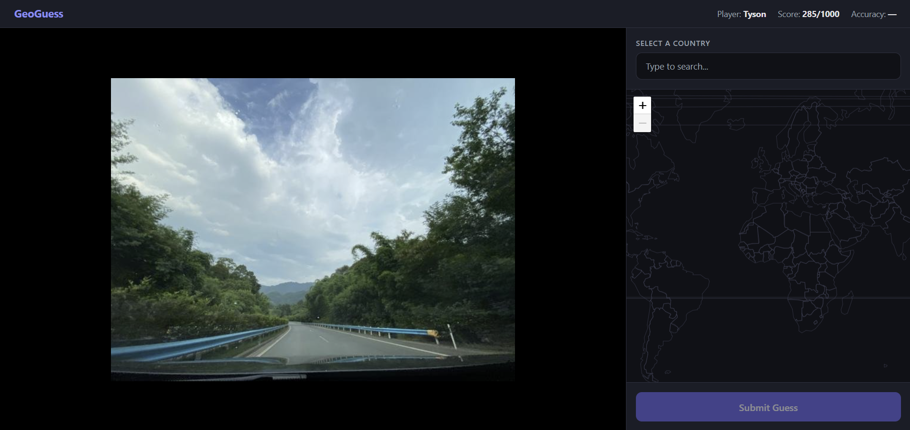
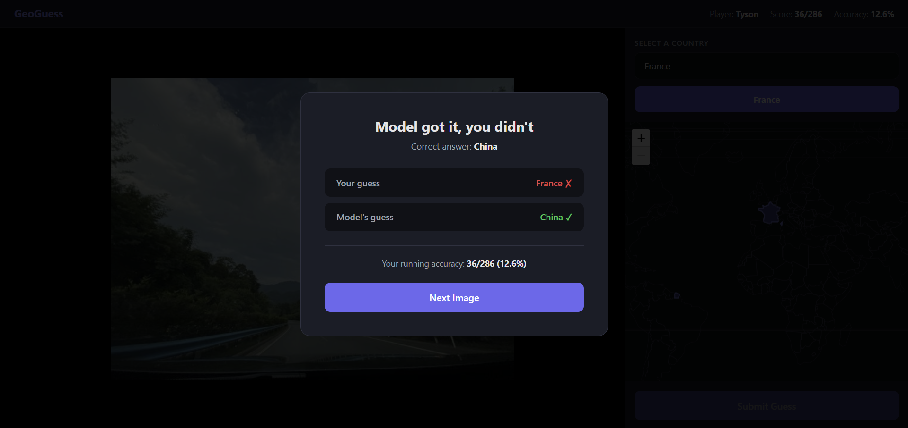

# GeoGuess: Country Prediction from Street-View Images

**Authors:** Jimin Lee, Juheon Kim, Sara Petrosian, Tyson Johnson, Heeseung Moon

[](https://colab.research.google.com/github/tjohns94/geolocation-project/blob/main/geolocation_guesser.ipynb)

## Overview

Can a machine learning model predict which country a photo was taken in better than humans can? This project fine-tunes an EfficientNet-B0 convolutional neural network on ~500,000 street-view images from the [OpenStreetView-5M](https://huggingface.co/datasets/osv5m/osv5m) dataset, then statistically compares its accuracy against a five-person case study group using McNemar's test.

**Key result:** The model achieves **64.7% accuracy** on 1,000 test images across 161 countries, significantly outperforming all human participants (8.7%–15.3% individually, 20.6% as a group oracle). All McNemar tests reject the null hypothesis at alpha = 0.05.

## Quick Start

### Option A: Google Colab (recommended)

1. Click the **Open in Colab** badge above (or [this link](https://colab.research.google.com/github/tjohns94/geolocation-project/blob/main/geolocation_guesser.ipynb))
2. **Runtime > Run all** — the notebook automatically clones this repo and loads all data
3. No setup, no uploads, no GPU needed (default mode runs analysis only)

### Option B: Local (VS Code, JupyterLab, etc.)

```bash
git clone https://github.com/tjohns94/geolocation-project.git
cd geolocation-project
pip install pandas numpy matplotlib seaborn scipy
jupyter notebook geolocation_guesser.ipynb
```

Then **Run All Cells**. The notebook detects it's already inside the repo and skips cloning.

## Run Modes

The notebook supports three modes via the `MODE` variable in the first code cell:

| Mode | What it does | Time | GPU? |
|------|-------------|------|------|
| `"analysis_only"` (default) | Loads pre-computed results, runs all statistical analysis and figures | ~1 min | No |
| `"evaluate"` | Downloads OSV-5M test shards, loads our checkpoint, re-runs model evaluation, then analysis | ~30 min | Yes |
| `"train"` | Full training from scratch (~500K images, 6 epochs) + evaluation + analysis | ~2 hrs | Yes (A100) |

In `"evaluate"` and `"train"` modes, OSV-5M shards are downloaded from HuggingFace and cached to your Google Drive (if mounted) so subsequent runs skip the download. You'll need to set a HuggingFace token (`export HF_TOKEN=hf_your_token`) to access the dataset.

## Repository Structure

```
geolocation-project/
├── geolocation_guesser.ipynb           # Complete reproducible notebook
├── configs/
│   └── training.yaml                 # All hyperparameters
├── data/
│   ├── experiment_data.json          # Merged dataset: model predictions + human guesses
│   ├── best_model_efficientnet_b0.pt # Trained checkpoint (17 MB)
│   ├── best_model.pt                 # Old checkpoint for comparison (17 MB)
│   └── original1000.zip              # 1,000 test images from webapp (53 MB)
├── outputs/                          # Training artifacts from A100 run
│   ├── training_curves.png           # Loss/accuracy curves
│   ├── confusion_matrix.png          # Top-class confusion matrix
│   ├── sample_predictions.png        # Sample model predictions
│   ├── training_history.csv          # Per-epoch metrics
│   └── training_config.json          # Training run configuration
├── docs/                             # Documentation assets
│   ├── webapp_screenshot.png         # Webapp guessing interface
│   └── webapp_result.png             # Webapp result feedback
├── webapp/                           # Flask webapp source (country-match scoring)
│   ├── app.py
│   └── templates/index.html
├── webapp_points/                    # Flask webapp source (distance scoring)
│   ├── app.py
│   └── templates/index.html
└── README.md
```

## Methodology

### Part A — Model Training

EfficientNet-B0 (5.3M parameters), pretrained on ImageNet, fine-tuned on ~500,000 OSV-5M street-view images across 180 countries. Trained for 6 epochs with AdamW (lr=3e-4), cosine LR schedule, mixed precision, and early stopping. Achieves 75.0% validation top-1 accuracy and 57.6% test accuracy on the full held-out evaluation set.

### Part B — Human Data Collection

A custom Flask webapp deployed at `https://hanguk.dev/geoguess/` presented 1,000 test images to five case study participants, who produced 2,579 total guesses across all 1,000 images. The webapp prioritizes showing overlapping images to maximize paired comparisons.

### Part C — Statistical Analysis

McNemar's test compares paired binary outcomes (correct/incorrect) on the same images between the model and each human participant. Three group aggregation methods (any-correct oracle, majority vote, average score) provide group-level comparisons. All tests reject H_0 with overwhelming significance.

## Results

| Entity | Accuracy | N |
|--------|----------|---|
| EfficientNet-B0 | **64.70%** | 1,000 |
| Old model | 32.10% | 1,000 |
| Group (any correct) | 20.60% | 1,000 |
| Group (majority vote) | 12.70% | 1,000 |
| Heeseung (best individual) | 15.28% | 144 |
| Random baseline | 0.62% | — |

## Try the Webapp Locally

The `webapp/` directory contains the Flask app used to collect human guesses during the experiment. You can run it locally to see the guessing interface firsthand, or try the live version at [hanguk.dev/geoguess](https://hanguk.dev/geoguess/).





```bash
pip install flask
cd webapp
python app.py
```

Then open `http://localhost:5000`. The app automatically extracts test images from `data/original1000.zip` and generates its manifest from `data/experiment_data.json` on first run — no manual setup needed.

There's also a `webapp_points/` variant that uses GeoGuessr-style distance scoring (click on a map to place a pin, scored by haversine distance) instead of binary country matching.

## License

This project is licensed under the [MIT License](LICENSE). The OSV-5M dataset is provided under its own license by the original authors.
